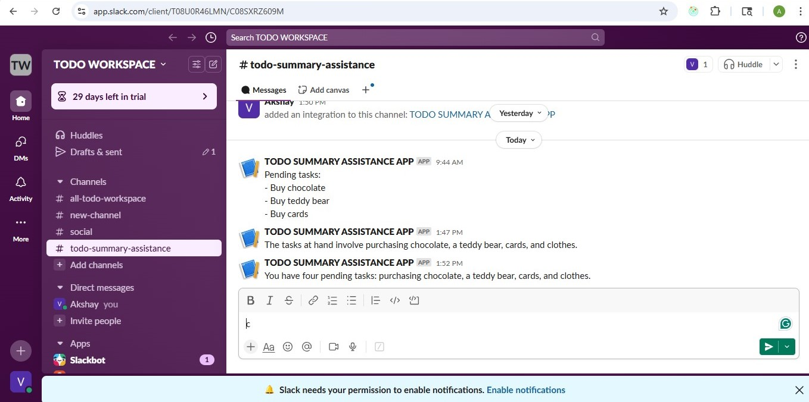

Todo Summary Assistant
Overview
The Todo Summary Assistant is a full-stack application for managing to-do items, summarizing pending tasks using OpenAI's language model, and sending the summaries to a Slack channel. Users can add, delete, and view to-dos through a React frontend, store data in Supabase, and generate meaningful summaries (e.g., "You have four pending tasks involving purchasing chocolate, a teddy bear, cards, and clothes") that are posted to Slack via Incoming Webhooks.
Setup Instructions
Prerequisites

Node.js (v16 or higher) and npm for running the frontend and backend.
Git to clone the repository.
Supabase account for the database.
OpenAI account for the LLM.
Slack workspace with permission to create apps and webhooks.

1. Clone the Repository
   git clone https://github.com/newwdeveloper/TODO-Summary-Assistance-App
   cd your-repo

2. Backend Setup

Navigate to the backend directory (if separate, e.g., backend/):cd backend

Install dependencies:npm install

Copy .env.example to .env and fill in the required variables:cp .env.example .env

Edit .env with your Supabase, OpenAI, and Slack credentials (see Environment Variables).
Start the backend server:npm start

The server runs on http://localhost:5000 (or your configured port).

3. Frontend Setup

Navigate to the frontend directory (if separate, e.g., frontend/):cd frontend

Install dependencies:npm install

Start the React development server:npm start

The frontend runs on http://localhost:5173.

4. Supabase Setup

Sign up at Supabase and create a new project.
Get your Project URL and Anon Key from the project settings (API section).
Create a todos table with columns:
id (auto-incrementing primary key)
description (text)
status (text, e.g., "pending" or "completed")

Add the SUPABASE_URL and SUPABASE_KEY to your .env file (see Environment Variables).

5. OpenAI Setup

Sign up at OpenAI and create an API key.
Add the OPENAI_API_KEY to your .env file (see Environment Variables).
The backend uses the gpt-4o-mini model to generate summaries. Ensure your API key has access to this model.

6. Integrating Slack Incoming Webhooks
   This section explains how to set up Slack Incoming Webhooks to post summaries of pending to-do items to a Slack channel. The application sends LLM-generated summaries, such as "You have four pending tasks involving purchasing chocolate, a teddy bear, cards, and clothes."
   Below is a placeholder screenshot of a sample summary posted to a Slack channel. Replace this with your actual screenshot by storing it in images/slack_summary_screenshot.png and updating the image path below.

Prerequisites

A Slack workspace with permission to create apps and webhooks.
Basic knowledge of making HTTP requests in Node.js (e.g., using Axios).

Step 1: Create a Slack App

Go to the Slack API website.
Click Create New App.
Enter a name (e.g., "Todo Summary Bot") and select your workspace.
Click Create App.

Step 2: Enable Incoming Webhooks

In your app's settings, navigate to Incoming Webhooks.
Toggle the switch to enable Incoming Webhooks.

Step 3: Create a Webhook URL

Scroll down to the Webhook URLs for Your Workspace section.
Click Add New Webhook to Workspace.
Select the Slack channel for summaries (e.g., #todo-summaries).
Click Authorize.
Copy the generated Webhook URL (e.g., https://hooks.slack.com/services/xxx/yyy/zzz).

Step 4: Configure the Webhook in Your Project

Add the Webhook URL to your .env file as SLACK_WEBHOOK_URL:SLACK_WEBHOOK_URL=https://hooks.slack.com/services/xxx/yyy/zzz

In the backend (summarizedTodos.js), the application sends an HTTP POST request to the Webhook URL with the summary in a JSON object:{
"text": "You have four pending tasks involving purchasing chocolate, a teddy bear, cards, and clothes."
}

Step 5: Test the Integration

Test the webhook with Postman:POST <your-slack-webhook-url>
Body: { "text": "Test: Todo Summary Assistant" }

In the app, add pending to-dos (e.g., "Buy chocolate"), click "Summarize and Send to Slack," and check the Slack channel for the summary (as shown in the screenshot above, once replaced).
Verify the backend logs for the OpenAI Summary: output to confirm the LLM response.

Replacing the Placeholder Screenshot
To replace the placeholder with your actual Slack screenshot:

Capture a screenshot of your Slack channel showing the summary.
Save it as slack_summary_screenshot.png in the images/ folder.
Update the image reference in this README:

Commit and push the changes:git add images/slack_summary_screenshot.png README.md
git commit -m "Replace placeholder with actual Slack screenshot"
git push origin main

Troubleshooting

Invalid Webhook URL: Verify the URL is correct and authorized. Test with Postman.
No Messages in Slack: Check server logs and ensure SLACK_WEBHOOK_URL is in .env.
Rate Limits: See Slack API rate limits.

Security Note

Store the Webhook URL in .env and ensure .env is in .gitignore to avoid exposing it.

Additional Resources

Slack Incoming Webhooks documentation

Environment Variables
Copy .env.example to .env and fill in the values:
SUPABASE_URL=your_supabase_project_url
SUPABASE_KEY=your_supabase_anon_key
OPENAI_API_KEY=your_openai_api_key
SLACK_WEBHOOK_URL=your_slack_webhook_url

Design/Architecture Decisions

1. Tech Stack

Frontend: React
Chosen for its component-based architecture and rich ecosystem (e.g., react-toastify for notifications, react-spinners for loading states).
Provides a responsive, user-friendly UI for managing to-dos.

Backend: Node.js/Express
Lightweight and scalable for handling API requests.
Integrates easily with Supabase, OpenAI, and Slack via HTTP clients (Axios).

Database: Supabase
Open-source, PostgreSQL-based, with a simple JavaScript client for real-time data.
Chosen over Firebase for its SQL familiarity and free tier.

LLM: OpenAI (gpt-4o-mini)
Selected for its cost-effective, high-quality text generation.
Generates concise, meaningful summaries without bullet points.

Slack: Incoming Webhooks
Simple and lightweight compared to a full Slack bot, ideal for one-way notifications.

2. Separation of Concerns

Frontend: Handles UI rendering, user interactions, and API calls (via api.js).
Backend: Manages business logic, database queries, LLM integration, and Slack communication.
Modular Configs: Separate files (supabaseConfig.js, openAIConfig.js, slackConfig.js) for clean dependency management.

3. LLM Integration

Used gpt-4o-mini for its balance of performance and cost.
Crafted a precise prompt to ensure summaries are concise and narrative-driven:Summarize the following ${todos.length} pending to-do items in one concise sentence, starting with "You have ${todos.length} pending tasks" and avoiding bullet points, the word "Summary", or repeating the list verbatim

4. Slack Integration

Chose Incoming Webhooks for simplicity, avoiding the complexity of a Slack bot.
Secured the webhook URL in .env to prevent exposure.
Included a placeholder screenshot in the README, with instructions to replace it, enhancing documentation.

5. Error Handling and UX

Backend: Uses try/catch and AppError middleware for robust error handling (e.g., OpenAI quota errors).
Frontend: Displays loading spinners (ClipLoader) and toast notifications (react-toastify) for user feedback.
Validation: Prevents empty to-do submissions and handles edge cases (e.g., no pending to-dos).

6. Scalability Considerations

Supabase supports real-time subscriptions, enabling future features like live to-do updates.
Express routes are modular, allowing easy addition of endpoints.
OpenAI’s API is scalable for larger task lists or more complex prompts.

Troubleshooting

Backend Errors: Check server logs and .env variables.
Frontend Issues: Ensure the backend API is running and CORS is configured.
Supabase: Verify table schema and anon key permissions.
OpenAI: Check API key validity and quota limits.
Slack: Test the webhook URL and check rate limits.

Future Improvements

Add real-time to-do updates using Supabase subscriptions.
Enhance the LLM prompt to categorize tasks (e.g., "shopping" vs. "personal").
Include a video demo in the README to show the full flow.
Implement retry logic for failed API requests.
